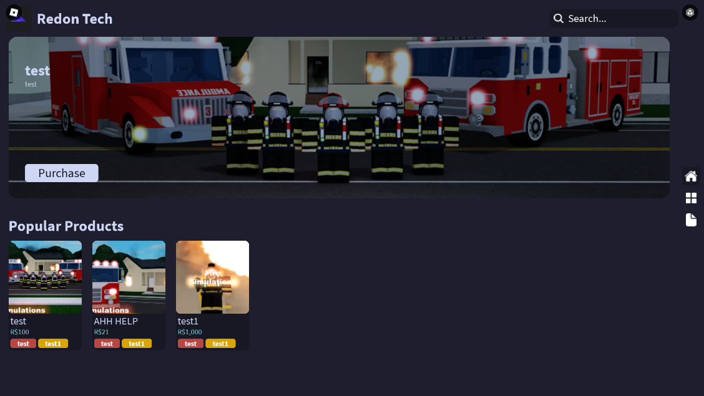

---
authors:
    - parker02311
---

We have a couple pre-made themes that you can use. You can also make your own theme if you want. If you do make your own theme please consider making a pull request to add it to the repository!

## Pre-made Themes

??? tip "Default"
    <figure markdown>
        
        <figcaption>parker02311 (Inspired by Bootswatch)</figcaption>
    </figure>

??? tip "Cyborg"
    <figure markdown>
        
        <figcaption>[Bootswatch](https://bootswatch.com/cyborg)</figcaption>
    </figure>

??? tip "Catppuccin Latte"
    <figure markdown>
        
        <figcaption>[Catppuccin](https://catppuccin.com)</figcaption>
    </figure>

??? tip "Catppuccin Mocha"
    <figure markdown>
        
        <figcaption>[Catppuccin](https://catppuccin.com)</figcaption>
    </figure>